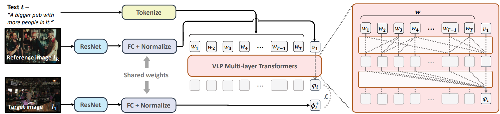

# CIRPLANT

This repository contains the code and pre-trained models for **C**omposed **I**mage **R**etrieval using **P**retrained **LAN**guage **T**ransformers (CIRPLANT)

For details please see our [ICCV 2021 paper](#) - **Image Retrieval on Real-life Images with Pre-trained Vision-and-Language Models**.



If you find this repository useful, we would appreciate it if you could give us a star.

-----
>You are currently viewing the [code & model repository](https://github.com/Cuberick-Orion/CIRPLANT). For more information, see our [Project homepage](https://cuberick-orion.github.io/CIRR/).


## Introduction
CIRPLANT is a transformer based model that leverages rich pre-trained vision-and-language (V\&L) knowledge for modifying visual features conditioned on natural language.
To the best of our knowledge, this is the first attempt in repurposing a V\&L pre-trained (VLP) model for composed image retrieval- a task that requires language-conditioned image feature modification.

Our intention is to extend current methods to the open-domain. Together with the release of the CIRR dataset, we hope this work can inspire further research on composed image retrieval  

## Installation & Dataset Preparation

Check [INSTALL.md](INSTALL.md) for installation instructions.

## Training

To train the model and reproduce our published results on CIRR:

```bash
python trainval_oscar.py --dataset cirr --usefeat nlvr-resnet152_w_empty --max_epochs 300 --model CIRPLANT-img --model_type 'bert' --model_name_or_path data/Oscar_pretrained_models/base-vg-labels/ep_107_1192087 --task_name cirr --gpus 1 --img_feature_dim 2054 --max_img_seq_length 1 --model_type bert --do_lower_case --max_seq_length 40 --learning_rate 1e-05 --loss_type xe --seed 88 --drop_out 0.3 --weight_decay 0.05 --warmup_steps 0 --loss st --batch_size 32 --num_batches 529 --pin_memory --num_workers_per_gpu 0 --comment input_your_comments --output saved_models/cirr_rc2_iccv_release_test --log_by recall_inset_top1_correct_composition

```

To use pre-trained weights to reproduce results in our [ICCV 2021 paper](#), please see [DOWNLOAD.md](DOWNLOAD.md).

## Developing
To develop based on our code, we highly recommend first getting familar with Pytorch Lightning.

You can train models as we have described above, the results will be saved to a folder of your choosing.

To inspect results, we recommend using Tensorboard and load the saved `events.out.tfevents` file. Alternatively, you can also find all information dumped to a text file `log.txt`.

Pytorch Lightning automatically saves the latest checkpoint `last.ckpt` in the same output directory. Additionally, you can also specify a certain validation score name `--log_by [...]` to monitor, which enables saving of the best checkpoint.

## Test-split Evaluation
We do not publish the ground truth for the test split of CIRR. Instead, we host an [evaluation server](https://cirr.cecs.anu.edu.au/), should you prefer to publish results on the test-split.

To generate a `.json` file and upload to the test server, load a trained checkpoint and enable `--testonly`.

As an example, compare the following arguments with the training arguments above.
```bash
python trainval_oscar.py --dataset cirr --usefeat nlvr-resnet152_w_empty --max_epochs 300 --model CIRPLANT-img --model_type 'bert' --model_name_or_path data/Oscar_pretrained_models/base-vg-labels/ep_107_1192087 --task_name cirr --gpus 1 --img_feature_dim 2054 --max_img_seq_length 1 --model_type bert --do_lower_case --max_seq_length 40 --learning_rate 1e-05 --loss_type xe --seed 88 --drop_out 0.3 --weight_decay 0.05 --warmup_steps 0 --loss st --batch_size 32 --num_batches 529 --pin_memory --num_workers_per_gpu 0 --comment input_your_comments --output saved_models/cirr_rc2_iccv_release_test --log_by recall_inset_top1_correct_composition --check_val_every_n_epoch 1 --testonly --load_from_checkpoint $CKPT_PATH
```

A `.json` file will be saved to the output directory. Visit our test server and upload it to get results.

## Citation
Please consider citing this paper if you use the code:
```
# TODO
```